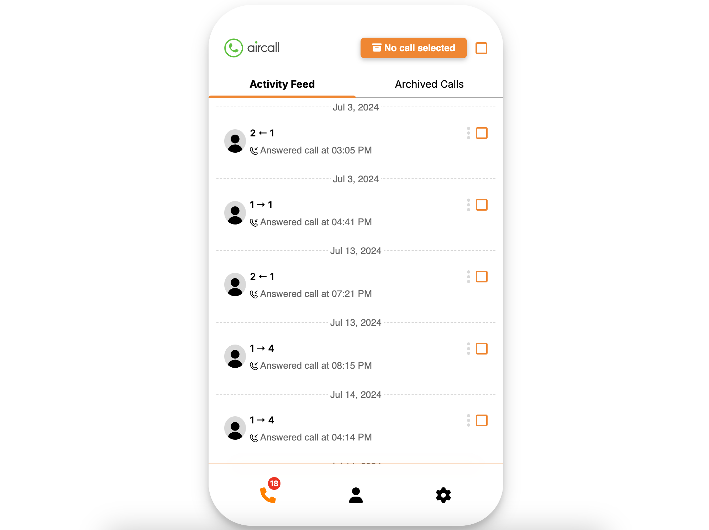
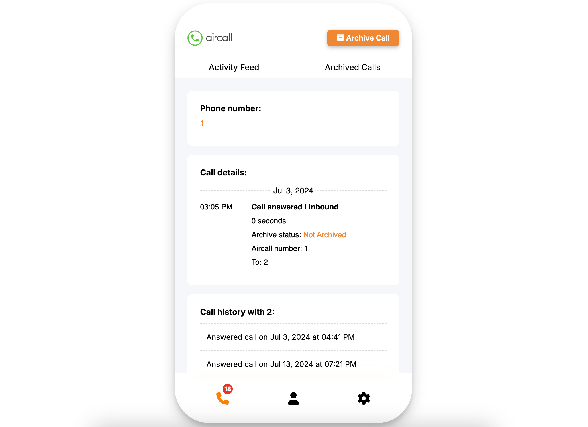

# Activity Feed ReactJS App

This is a ReactJS app that simulates an activity feed for call logs. It includes features such as viewing activity details, archiving calls, and unarchiving them. The app allows the user to manage a list of calls by displaying details, allowing archiving actions, and viewing the history of calls.

## Features

- **Activity Feed**: Displays a list of calls with a summary of key information.
- **Activity Detail**: Displays detailed information about a specific call.
- **Archiving**: Users can archive and unarchive calls. Archived calls are displayed in a separate tab.
- **Archive All**: A button that allows users to archive all calls in the activity feed.
- **Unarchive All**: A button that allows users to unarchive all calls in the archived calls tab.

## Installation

The app is built using ReactJS. To set up the project, follow these steps:

1. Clone the repository to your local machine:
    ```bash
    git clone https://github.com/lpattersonn/773c8c0f.git
    ```
2. Navigate to the project directory:
    ```bash
    cd 773c8c0f
    ```
3. Install dependencies:
    ```bash
    yarn install
    ```
    Or if you prefer npm:
    ```bash
    npm install
    ```
4. Start the development server:
    ```bash
    yarn start
    ```
    Or if you are using npm:
    ```bash
    npm start
    ```

Make sure to run the app in Node version 16.

## API Documentation

The app communicates with a sample API to retrieve and manage call data.

- **Base URL**: [https://aircall-api.onrender.com](https://aircall-api.onrender.com/)

### Endpoints

- **GET** - `/activities`: Fetches all activities to display in the Activity Feed.
- **GET** - `/activities/<call_id>`: Fetches detailed information for a specific call.
- **PATCH** - `/activities/<call_id>`: Updates a call's `is_archived` status. You can archive or unarchive a call by sending:
  ```json
  {
    "is_archived": true
  }
### PATCH - /reset
Resets all calls to their initial state (useful when all calls are archived).

### Call Object

- `id`: Unique ID of the call.
- `created_at`: Timestamp when the call was made.
- `direction`: The call direction (`inbound` or `outbound`).
- `from`: The caller's phone number.
- `to`: The callee's phone number.
- `via`: The Aircall number used for the call.
- `duration`: Duration of the call in seconds.
- `is_archived`: Whether the call is archived (`true` or `false`).
- `call_type`: The type of call (`missed`, `answered`, or `voicemail`).

---

### Design & User Experience

The app is designed with usability in mind, focusing on:

- Clean and simple UI/UX for ease of interaction.
- Smooth transitions for switching between the Activity Feed and Activity Detail pages.
- Clear call-to-action buttons for archiving/unarchiving calls.

---

### Screenshots

#### Activity Feed Page
  
*Above is a screenshot of the Activity Feed page.*

#### Activity Detail Page
  
*Above is a screenshot of the Activity Detail page showing call information.*

---

### Deployment

The app is deployed on [Netlify](https://app.netlify.com/) for live interaction. You can access the live version of the app at the following URL:

[Live App](https://leshan-assessment-aircall.netlify.app/)

---

### Assessment Criteria

This project will be assessed based on the following criteria:

- **UI/UX Design**: Attention to design details, user-friendly interface, and smooth transitions.
- **React Best Practices**: Efficient state management using React Context, clean component structure, and reusable functions.
- **Code Readability and Maintainability**: Well-organized and documented code, following industry best practices.
